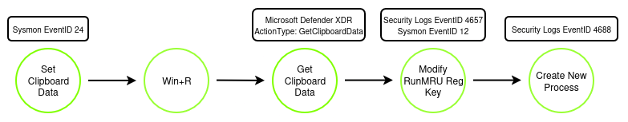
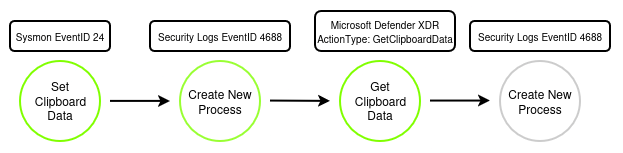

# Clickfix

## Metadata

| Key          | Value           |
|--------------|-----------------|
| ID           | TRR0000         |
| External IDs | [T1204.004]     |
| Tactics      | Execution       |
| Platforms    | Windows         |
| Contributors | Logan Darger    |

## Technique Overview

Clickfix does not refer to a single attack, but rather to an evolving family of 
social engineering mechanisms in which a user is lured into initiating malicious 
code through a copy and paste action disguised as a "quick fix" to common 
computer issues. This style of attack has undergone numerous and continued 
iterations, morphing into variants that target alternate execution vectors, such 
as using the explorer address bar to launch cmd in the case of the FileFix 
variant. While the specifics regarding the social engineering lure (e.g. MFA 
verification, CAPTCHA challenge) and the underlying execution method (e.g. 
powershell, wt.exe) vary by malware family and threat actor, the broadstroke 
context of malicious copy/paste remains a taxonomical through-line. A few of the 
more commonly used variants will be covered here, but it should be noted that 
this form of social engineering is in widespread use and new execution methods 
may still emerge. Furthermore, while originally a Windows initial access attack, 
new variants targeting MacOS and Linux have been observed [^1]. The scope and 
focus here however, will remain on Windows exclusive variants.

## Technical Background

A defining mechanic of the ClickFix family of attacks is the abuse of the 
clipboard. Instead of simply dropping a malicious file, ClickFix style campaigns 
utilize JavaScript payloads on fake or cloned web pages to silently copy a 
highly obfuscated command, often Base64 encoded PowerShell script or shell 
commands, directly into the user's system clipboard without the user's 
knowledge. This covert action provides the raw payload necessary for execution. 

The attack necessitates that the victim manually moves from a deceptive webpage 
interface to a legitimate OS command prompt and pastes the content of the 
clipboard into this console, thereby initiating the malicious payload. 
The resultant action appears as standard user-initiated activity.

Modern advanced phishing pages like ClickFix are specifically engineered with 
detection evasion techniques (e.g., obfuscation, domain rotation) that bypass 
traditional security tools, including email scanners and network proxies. 
Because the malicious code execution is copied inside the browser's controlled 
sandbox, typical perimeter defenses lose visibility. Consequently, the only 
viable "last resort" opportunity for mitigation is on the endpoint, after 
the user has interacted with the phishing content [^2], [^3].

## ClickFix Variants

The widespread use of ClickFix campaigns has spun off a large number of 
evolutions of the original attack [^4]. While there is no authoritative standard 
of identifying these various distinctions within the "ClickFix family of 
attacks" Clickfix attacks can broadly be categorized into two vector groups: Run 
Dialog attacks and Terminal attacks [^5]. Much of the detail regarding the 
variants of either category of attacks relate to the steps or mechanisms needed 
to reach this execution fork.

### Run Dialog Variants

Run Dialog variants are attacks in which the user is prompted to paste malicious 
payloads into the Run Dialog window, usually through the use of Win+R hotkeys. 
This method originally used powershell as its mode of execution though examples 
of other methods exist as well, such as mshta.exe or rundll32.exe. Variation 
within the Run Dialog category is typically distinguished by differences in the 
phishing lure rather than execution method.

#### CrashFix/GlitchFix

From an attack vector standpoint, the CrashFix variant functions nearly 
identically to classic ClickFix and is included here more as an example of Run 
dialog evolutions rather than as a distinct detection opportunity. The primary 
difference here is that CrashFix introduces fake browser crash dialogs to create 
the perception of browser instability as the initiating trigger, making the 
remedial action—the malicious input—seem necessary for system stabilization 
[^6].

### Terminal Attacks

While classic ClickFix campaigns direct victims to the Windows Run dialog, 
TerminalFix campaigns apply the same phishing technique but direct users to 
Windows Terminal or PowerShell instead, increasing the likelihood that complex, 
multi-line scripts execute successfully. Variation within the Terminal attack 
category typically defines in what way the user is directed to the terminal 
[^7].

#### TerminalFix

The overall vector of TerminalFix is very similar to that of a classic Clickfix 
attack: when the user interacts with the fake verification prompt, a malicious 
PowerShell command is silently copied to their clipboard. The major divergence 
being at the point when the user is subsequently guided to open Windows Terminal 
and paste the command there. In a standard Terminalfix attack, this is done with 
the either hotkey sequence `Win+X` and `i` or `Win+X` with a manual click on the 
`Terminal` option in the context menu. While there is no inherent payload 
limitations, TerminalFix was originally observed to execute a staged payload 
with DLL sideloading and steganographic extraction to achieve initial access.

#### FileFix

FileFix represents a notable deviation from the original TerminalFix method. The 
core innovation here involves changing the point of user interaction from a 
dedicated command prompt dialogue to the File Explorer address bar [^8]. Victims 
are manipulated into pasting malicious file paths or commands directly into the 
File Explorer resource path, leading to malware execution through seemingly 
innocuous file system manipulation. It also introduces a significantly expanded 
attack surface by introducing attacker-chosen execution platforms similar to 
that seen with Run dialog variants 
 
Unlike simply executing a 
PowerShell command in `powershell.exe`, pasting a crafted path or complex 
command string (e.g., one using `mshta.exe` or advanced scripting) causes 
Windows to interpret and execute malicious code associated with that path. 
Because the initial actions are framed as navigating or addressing a file path, 
the malicious activity is often seen by security tooling merely as navigation (a 
"Living-Off-the-Land" technique), making it difficult to differentiate from 
legitimate user activity [^9].

### RunRMU

An interesting aspect of the Run dialog is its use of [Most Recently Used] (MRU) 
elements as this provides a unique detection opportunity for all Run dialog 
variants of ClickFix. This feature saves the last 26 entries typed into the Run 
dialog for later use into the registry. The key located at 
`Software\Microsoft\Windows\CurrentVersion\Explorer\RunMRU` within a user's 
`NTUSER.DAT` file. This artifact records the full command history as typed by 
the user, providing deep insight into victim actions and attacker commands 
executed via the Run box. RunMRU key contains multiple values that are named for 
lowercase letters. These values store the commands that a user run using the Run 
utility. The first value added is named “a”, the second value is named “b”, 
then, “c” and so on. However, the names of the values do not always reflect the 
order in which the commands were typed into the Run box. This information is 
maintained in the “MRUList” value which is a string that lists the order in 
which each value beneath the RunMRU key was last accessed. For instance, in the 
figure below, the first letter listed in the MRUList is “c”. The value named “c” 
stores the command “chrome” which means that the most recent command typed into 
the Run box is “chrome”. 

Deleting a value from RunMRU key will cause that entry to be removed from the 
history list of the Run utility. However, deleting the RunMRU key or any of its 
values does not remove the history list in Run utility immediately. The user has 
to close the Run window for the action to be effective. [^10]

### Clipboard Data

The core functionality of the entire ClickFix attack family is the use of the 
clipboard as a means of payload delivery. The clipboard in this context revolves 
around two Win32 API calls, [SetClipboardData] and [GetClipboardData], which are 
used to copy and paste, respectively. In a classic ClickFix attack, a payload is 
silently copied with Javascript using the `navigator.clipboard.writeText()` 
function. As of [Sysmon 12], these types of `SetClipboardData` events are logged 
with an [EventID 24]. Additionally, this data being retrieved from the clipboard 
is logged within Microsoft Defender XDR as `GetClipboardData` [ActionTypes]. 
Beyond this, there are a number of other methods for monitoring clipboard 
activity, such as `Activitescache.db`, though they can be dependent on 
environmental configurations [^11]

## Procedures

| ID | Title | Tactic |
|----|----|----|
| TRR0000.WIN.A | ClickFix: Run Dialog | Execution |
| TRR0000.WIN.B | ClickFix: Terminal   | Execution |

### Procedure A: ClickFix: Run Dialog

All ClickFix variants whose execution is performed by leveraging the Run dialog 
fall under this category regardless of the executable being called. Monitoring 
changes to the RunMRU registry keys at 
`Software\Microsoft\Windows\CurrentVersion\Explorer\RunMRU`([Windows Security 
Log EventID 4657]) can be used to identify this activity in almost all 
circumstances with one notable exception: if the exact string has already been 
entered into the Run dialog and has not been cleared from the registry, a new 
key will not be created. Due to the very specific nature of the executing 
strings used to achieve initial access in ClickFix campaigns, this is an 
extremely unlikely 
situation.

### Procedure B: ClickFix: Terminal

A ClickFix variant whose clipboard content is pasted directly into its executing 
program falls under this category. At a fundamental level, this activity is 
harder to detect as running benign system binaries and accessing clipboard 
contents are both expected and frequent end user behavior. There are also as 
many ways for this variant to transition from phishing lure to executing 
application as there are ways to execute the program itself. This high level of 
customization makes detecting on application execution unreliable. Sysmon 
EventID 12 and Microsoft Defender XDR `GetClipboardData` Actions can be used to 
monitor for malicious content being written to and read from the clipboard.

## References

- [Think before you Click(Fix)]
- [ClickFix Attack: Variants, Detection & How It Works]
- [Threats based on Clipboards actions (+ KQL Query)]
- [The One Chokepoint to Rule Them All]
- [Fake Google and Cloudflare Verification Pages]
- [Detecting and Stopping ClickFix Attacks Before They Reach Your Endpoints]
- [ClickFix: Technique Overview]
- [How to Investigate RunMRU 2026]
- [Potential ClickFix Execution Pattern - Registry]
- ['TerminalFix' Campaign Weaponizes PowerShell for Enterprise Attacks]
- [TerminalFix looks like ClickFix, but delivers a very different payload]

[Think before you Click(Fix)]: https://www.microsoft.com/en-us/security/blog/2025/08/21/think-before-you-clickfix-analyzing-the-clickfix-social-engineering-technique/
[ClickFix Attack: Variants, Detection & How It Works]: https://www.huntress.com/blog/dont-sweat-clickfix-techniques
[Threats based on Clipboards actions (+ KQL Query)]: https://medium.com/@sergio.albea/threats-based-on-clipboards-actions-kql-query-93615eef79b7
[The One Chokepoint to Rule Them All]: https://ddosier-disects.medium.com/the-one-chokepoint-to-rule-them-all-why-i-deleted-50-clickfix-detection-rules-and-replaced-them-7c532206d32d
[Fake Google and Cloudflare Verification Pages]: https://www.malwarebytes.com/blog/threat-intel/2026/07/fake-google-and-cloudflare-verification-pages-spread-multiple-malware-families
[Detecting and Stopping ClickFix Attacks Before They Reach Your Endpoints]: https://www.opswat.com/blog/detecting-and-stopping-clickfix-attacks-before-they-reach-your-endpoints
[ClickFix: Technique Overview]: https://medium.com/@anyrun/clickfix-technique-overview-89977d1882b4
[How to Investigate RunMRU 2026]: https://www.cybertriage.com/blog/how-to-investigate-runmru-2026/
[Potential ClickFix Execution Pattern - Registry]: https://detection.fyi/sigmahq/sigma/windows/registry/registry_set/registry_set_potential_clickfix_execution
['TerminalFix' Campaign Weaponizes PowerShell for Enterprise Attacks]: https://www.darkreading.com/threat-intelligence/terminalfix-campaign-weaponizes-powershell-enterprise-attacks
[TerminalFix looks like ClickFix, but delivers a very different payload]: https://www.malwarebytes.com/blog/news/2026/09/terminalfix-looks-like-clickfix-but-delivers-a-very-different-payload

[T1204.004]: https://attack.mitre.org/techniques/T1204/004/
[Most Recently Used]: https://forensafe.com/blogs/runmrukey.html
[SetClipboardData]: https://learn.microsoft.com/en-us/windows/win32/api/winuser/nf-winuser-setclipboarddata
[GetClipboardData]: https://learn.microsoft.com/en-us/windows/win32/api/winuser/nf-winuser-getclipboarddata
[Sysmon 12]: https://www.bleepingcomputer.com/news/microsoft/microsoft-sysmon-now-logs-data-copied-to-the-windows-clipboard/
[EventID 24]: https://www.ultimatewindowssecurity.com/securitylog/encyclopedia/event.aspx?eventid=90024
[ActionTypes]: https://learn.microsoft.com/en-us/defender-xdr/advanced-hunting-deviceevents-table

[^1]: https://hunt.io/blog/macos-clickfix-applescript-terminal-phishing
[^2]: https://pushsecurity.com/blog/the-most-advanced-clickfix-yet
[^3]: https://www.huntress.com/blog/dont-sweat-clickfix-techniques
[^4]: https://blog.polyswarm.io/the-evolution-of-clickfix-mapping-the-growing-fix-family
[^5]: https://unit42.paloaltonetworks.com/preventing-clickfix-attack-vector/
[^6]: https://twit.tv/posts/tech/how-latest-clickfix-exploit-targets-windows-users
[^7]: https://www.microsoft.com/en-us/security/blog/2026/08/28/terminalfix-campaign-deploys-reverse-tunnel-through-multistage-intrusion/
[^8]: https://www.bridewell.com/insights/blogs/detail/filefix-the-evolved-clickfix
[^9]: https://mrd0x.com/filefix-clickfix-alternative/
[^10]: https://www.cybertriage.com/blog/how-to-investigate-runmru-2026/
[^11]: https://www.inversecos.com/2022/05/how-to-perform-clipboard-forensics.html
